# Sky Window Design & More — Web Design, UI/UX & Site Architecture Review

**Date:** July 31, 2026  
**Reviewer:** Manus AI (ui-ux-pro-max + site-architecture skills)  
**Scope:** Full audit of all 22 routes, navigation, internal linking, visual design, accessibility, and interaction patterns

---

## 1. Site Architecture Assessment

### 1.1 Current Page Hierarchy

```
Homepage (/)
├── Window Treatments (/window-treatments)
│   ├── Roller Shades (/roller-shades)
│   ├── Motorized Shades (/motorized-shades)
│   ├── Draperies & Curtains (/draperies-curtains)
│   ├── Plantation Shutters (/plantation-shutters)
│   ├── Cellular Shades (/cellular-honeycomb-shades)
│   ├── Roman Shades (/roman-shades)
│   └── Custom Blinds (/blinds)
├── Design Services (no parent page)
│   ├── Wallpaper & Interior Design (/wallpaper-interior-design)
│   ├── Commercial Window Treatments (/commercial-window-treatments)
│   ├── Visualizer (/visualizer)
│   └── Window Treatment Repairs (/window-treatment-repairs)
├── Service Areas (/service-areas)
│   ├── Gulf Shores, AL (/locations/gulf-shores-al)
│   ├── Foley, AL (/locations/foley-al)
│   ├── Fairhope, AL (/locations/fairhope-al)
│   ├── Pensacola, FL (/locations/pensacola-fl)
│   ├── Gulf Breeze, FL (/locations/gulf-breeze-fl)
│   └── Navarre, FL (/locations/navarre-fl)
├── About (/about)
├── Contact (/contact)
├── Privacy (/privacy)
└── Accessibility (/accessibility)
```

### 1.2 Architecture Strengths

| Strength | Detail |
|----------|--------|
| Flat URL structure | All service pages are at depth 1 (`/roller-shades`), keeping URLs clean and crawlable |
| Service Areas hub | `/service-areas` correctly groups all city pages, improving crawl depth |
| Breadcrumbs on all subpages | Every page except Home has visible breadcrumbs with clickable parent links |
| Cross-linking | City pages link to each other; StandardPages link to related products and services |
| 3-click rule | Any page is reachable within 2 clicks from the homepage via nav dropdowns |

### 1.3 Architecture Issues

| Issue | Severity | Detail |
|-------|----------|--------|
| **"Design Services" has no parent page** | Medium | The nav dropdown groups 4 pages under "Design Services" but there is no `/design-services` hub page. Users who click the dropdown label have no landing page — the `href` is `null`, rendering it a non-link button. This contrasts with "Window Treatments" which has a real `/window-treatments` page, and "Service Areas" which has `/service-areas`. |
| **City page breadcrumbs skip the hub** | Medium | City pages breadcrumb as `Home > City Name` instead of `Home > Service Areas > City Name`. The BreadcrumbList schema also only has 2 items. This breaks the breadcrumb-URL alignment principle: the URL is `/locations/gulf-shores-al` but the breadcrumb doesn't reflect the `/service-areas` parent. |
| **Mobile nav missing "All Service Areas" link** | Low | The desktop nav dropdown includes "All Service Areas" as the first item, but `MOBILE_NAV_GROUPS` for Service Areas does not include the hub page link. Mobile users have no path to `/service-areas` from the nav. |
| **Footer "More Services" column is hidden** | Low | `FOOTER_LINKS.moreServices` is defined in siteData.ts but never rendered in the footer. The footer only shows Services, Service Areas, and Contact columns. Wallpaper, Commercial, Repairs, Visualizer, and About are missing from the footer. |
| **404 page lacks recovery links** | Low | The NotFound page only offers "Back to Home" and "Call". No links to popular service pages, service-areas hub, or a search prompt. Users who hit a 404 from a broken external link have no contextual recovery path. |
| **No `/blog` or content hub** | Info | The site has no content marketing section. For a local service business competing on SEO, a blog or resource hub would significantly improve organic search visibility. |

### 1.4 URL Structure Observations

The URL patterns are mostly clean and consistent:

- Service pages use flat slugs: `/roller-shades`, `/motorized-shades` — good
- City pages use `/locations/{slug}` — good, but the parent `/locations` has no hub page (the hub is at `/service-areas` instead, creating a minor mismatch between URL path and navigation hierarchy)
- Legal pages use flat slugs: `/privacy`, `/accessibility` — good
- No trailing slashes enforced — the canonical URLs in siteData.ts use trailing slashes (e.g., `https://skywindowdesign.com/contact/`) but the routes in App.tsx don't include them. This creates a canonical-vs-actual-URL mismatch that search engines may flag as duplicate content.

---

## 2. UI/UX Assessment

### 2.1 Visual Design Strengths

| Strength | Detail |
|----------|--------|
| Cohesive color system | Three-color palette (brand blue `oklch(0.50 0.21 255)`, dark `oklch(0.15 0.02 255)`, surface `oklch(0.97 0.007 255)`) applied consistently across all pages via CSS variables in index.css |
| Typography hierarchy | Montserrat 700/800 for headings, Inter 400/500/600 for body, Petrona serif for hero — a well-considered three-font system that gives the site a premium editorial feel |
| Section rhythm | Alternating dark/light/surface sections create clear visual cadence on both homepage and service pages |
| Card hover effects | Service cards lift with `translateY(-2px)` + shadow expansion; dropdown items slide with a left accent bar — polished micro-interactions |
| Scroll reveal | IntersectionObserver-based reveal with 350ms ease-out, properly gated behind `prefers-reduced-motion` |
| CTA button system | Three button variants (primary, outline, outline-white) with consistent sizing, active scale, and focus-visible rings on nav/footer CTAs |

### 2.2 Visual Design Issues

| Issue | Severity | Detail |
|-------|----------|--------|
| **Accessibility & 404 pages use broken CSS tokens** | High | `Accessibility.tsx` references `var(--font-display)`, `var(--text-heading)`, `var(--text-muted)`, `var(--text-body)` — none of which exist in index.css. `NotFound.tsx` references `var(--brand-primary)`, `var(--brand-primary-hover)`, `var(--brand-primary-tint)`, `var(--font-display)`, `var(--text-heading)`, `var(--text-body)` — also undefined. These pages render with fallback/inheritance styling, making them visually inconsistent with the rest of the site. |
| **Viewport restricts zoom** | High | `index.html` line 5: `maximum-scale=1` prevents mobile users from pinch-zooming. This is an WCAG 2.1 Level A failure (Success Criterion 1.4.4: Resize text) and should be removed. |
| **Homepage hero lacks CTA hierarchy** | Medium | The hero shows a Google Reviews badge and a single "Get a Quote" button. There is no phone number CTA in the hero, no secondary action, and no scannable value proposition beyond the subheading. The trust bar below adds 3 items but the hero itself is thin on conversion drivers. |
| **Service pages reuse the same hero image 3 times** | Medium | On StandardPage, the same `heroImg` appears in the dark hero, the "What It Is" section, the dark features grid background, and the editorial sections. Seeing the same image 4 times on one page reduces visual variety and makes sections feel repetitive. |
| **No Open Graph or Twitter Card meta tags** | Medium | The `Seo.tsx` component only manages `title`, `description`, `canonical`, and JSON-LD. No `og:title`, `og:description`, `og:image`, `twitter:card`, or `twitter:image` tags are set. When users share links on social media, they will get generic or blank previews. |
| **Homepage "Orange Beach, AL" in service areas strip links to `/`** | Low | The first city pill in the service areas strip is "Orange Beach, AL" with `href="/"`, which links back to the homepage. This is misleading — it should either link to a dedicated Orange Beach city page or not be a link at all. |

### 2.3 Accessibility Audit

| Issue | Severity | WCAG Criterion | Detail |
|-------|----------|----------------|--------|
| **Zoom disabled** | High | 1.4.4 (AA) | `maximum-scale=1` in viewport meta tag prevents text resizing via zoom on mobile |
| **No skip-to-content link** | Medium | 2.4.1 (A) | No "Skip to main content" link exists. Keyboard users must tab through the entire header nav on every page. |
| **Dropdown menus are hover-only** | Medium | 2.1.1 (A) | Desktop nav dropdowns open on `onMouseEnter`/`onMouseLeave` only. Keyboard users cannot access dropdown items because there is no `onFocus`/`onBlur` handler or `aria-expanded` state. |
| **Broken CSS tokens on Accessibility page** | High | 1.4.3 (AA) | `var(--text-body)` and `var(--text-heading)` resolve to fallback values, likely producing insufficient contrast or unstyled text on the accessibility statement page itself — ironic and high-priority. |
| **Form inputs lack `aria-invalid` and error messaging** | Medium | 3.3.1 (A) | Both the Contact page form and the StandardPage consultation card form have no client-side validation, no error states, and no `aria-invalid` attributes. Required fields are only enforced via HTML5 `required` attribute. |
| **No `aria-label` on search-like elements** | Low | 4.1.2 (A) | The mobile nav hamburger has `aria-label="Open navigation menu"` (good), but the dropdown trigger buttons in desktop nav lack `aria-label` or `aria-haspopup="menu"`. |
| **Heading hierarchy on service pages** | Low | 1.3.1 (A) | StandardPage uses `h1` for the page title, `h2` for section headings, and `h3` for feature card titles — correct. But the "How It Works" section uses `h2` followed by `h3` for step titles, while the FAQ section uses `h2` with no `h3` for individual FAQ items (they're in an accordion). This is acceptable but could be improved. |

### 2.4 Interaction & Motion Audit

| Aspect | Status | Detail |
|--------|--------|--------|
| Button press feedback | Pass | All buttons use `scale(0.97)` on `:active` with 100-160ms ease-out |
| Hover transitions | Pass | 200ms cubic-bezier on nav CTA and footer CTA; 180ms ease-out on dropdown items |
| Scroll reveal | Pass | 350ms ease-out, IntersectionObserver, `prefers-reduced-motion` respected |
| Card hover | Pass | `translateY(-2px)` + shadow expansion, 200ms ease-out |
| Dropdown animation | Pass | Background slide + left accent bar, 180ms ease-out, reduced-motion fallback |
| Focus-visible rings | Partial | Nav CTA and footer CTA have `:focus-visible` rings; dropdown items have `:focus-visible` outline; but regular nav links and footer links do not have explicit focus-visible styles |
| Form submission feedback | Pass | Both forms show a success state with CheckCircle2 icon and confirmation text |
| Mobile sticky bar | Pass | Fixed bottom bar with Call + Consultation buttons, visible on all pages on mobile |

### 2.5 Responsive Behavior

| Breakpoint | Status | Notes |
|------------|--------|-------|
| 375px (mobile) | Mostly good | Nav collapses to hamburger; mobile sticky bar appears; grids stack to 1-col. However, the StandardPage hero grid `lg:grid-cols-[1fr_380px]` stacks at `<1024px`, which means tablet users see a very long hero with the consultation card below the content. |
| 768px (tablet) | Good | Product card grids go 2-col; trust bar goes 2-col then 4-col at `md` |
| 1024px (desktop) | Good | Full nav visible; 3-col product grids; 2-col editorial layouts |
| 1440px+ | Good | Container max-width 1280px centers content; no stretching issues |

---

## 3. Internal Linking Analysis

### 3.1 Link Inventory

| Page Type | Inbound Links | Outbound Links |
|-----------|---------------|----------------|
| Homepage | All pages (via logo, breadcrumbs) | 7 product cards, 7 city pills, nav links, CTAs |
| Service pages | Nav dropdown, footer, related product cards, related text links | Related products (3), related services text links, CTAs to /contact |
| City pages | Nav dropdown, footer, service-areas hub, other city cross-links | 6 product cards, 5 other city cross-links, CTAs |
| Service Areas hub | Nav dropdown, footer | 6 city cards |
| Contact | Nav CTA, footer CTA, all page CTAs | — |
| About | Nav, footer (hidden) | — |

### 3.2 Linking Issues

| Issue | Severity | Detail |
|-------|----------|--------|
| **Footer missing "More Services" column** | Medium | `FOOTER_LINKS.moreServices` is defined but never rendered. 5 pages (Wallpaper, Commercial, Repairs, Visualizer, About) are invisible in the footer. |
| **No cross-links from service pages to city pages** | Medium | Service pages (StandardPage) link to related products and related services, but never to relevant city pages. A user reading about roller shades should see "Available in Gulf Shores, Foley, Pensacola..." links. |
| **No cross-links from city pages to specific service pages** | Low | City pages show 6 product cards (which link to service pages), but the text content doesn't contextually link to specific services. The product cards are the only service links. |
| **Service Areas hub doesn't link to core services** | Low | The hub page lists 6 city cards but doesn't link to `/window-treatments` or other service pages. Adding a "Popular Services" strip would improve the hub page's SEO value. |

---

## 4. Recommendations (Prioritized)

### Priority 1 — Critical (Fix Now)

| # | Recommendation | Effort |
|---|---------------|--------|
| 1.1 | **Remove `maximum-scale=1` from viewport meta tag** in `index.html`. Change to `width=device-width, initial-scale=1.0` only. This is a WCAG 2.1 Level A failure. | 1 min |
| 1.2 | **Fix broken CSS tokens in `Accessibility.tsx` and `NotFound.tsx`**. Replace `var(--font-display)`, `var(--text-heading)`, `var(--text-muted)`, `var(--text-body)`, `var(--brand-primary)`, `var(--brand-primary-hover)`, `var(--brand-primary-tint)` with the actual tokens from index.css: `'Montserrat'`, `text-slate-900`, `text-slate-500`, `text-slate-600`, and the `btn-primary`/`btn-outline` classes. | 30 min |
| 1.3 | **Add keyboard support to desktop nav dropdowns**. Add `onFocus`/`onBlur` handlers to the dropdown container, `aria-haspopup="menu"` and `aria-expanded` to the trigger button, and ensure Tab key can open and navigate dropdown items. | 1 hour |

### Priority 2 — High (Next Sprint)

| # | Recommendation | Effort |
|---|---------------|--------|
| 2.1 | **Add Open Graph and Twitter Card meta tags** to `Seo.tsx`. Accept `ogImage` prop and render `og:title`, `og:description`, `og:image`, `og:url`, `twitter:card`, `twitter:title`, `twitter:description`, `twitter:image`. | 1 hour |
| 2.2 | **Create a `/design-services` hub page** (or rename the nav label to link to an existing page). The 4 "Design Services" pages are orphaned from a navigation hierarchy perspective — they have no parent landing page. | 2 hours |
| 2.3 | **Fix city page breadcrumbs** to `Home > Service Areas > City Name` and update the BreadcrumbList schema to 3 items. | 30 min |
| 2.4 | **Render the footer "More Services" column** or merge it into the Services column. Currently 5 pages are invisible in the footer. | 15 min |
| 2.5 | **Add "All Service Areas" link to mobile nav** `MOBILE_NAV_GROUPS` Service Areas group. | 5 min |
| 2.6 | **Add a skip-to-content link** as the first element in the Layout, visually hidden until focused. | 15 min |

### Priority 3 — Medium (Backlog)

| # | Recommendation | Effort |
|---|---------------|--------|
| 3.1 | **Vary the images on StandardPage**. Use different images for the hero, "What It Is" section, features grid background, and editorial sections. Currently the same `heroImg` appears 4 times per page. | 2 hours |
| 3.2 | **Add cross-links from service pages to city pages**. A "Available in Your Area" strip with city links would improve internal linking and help users find local service pages. | 30 min |
| 3.3 | **Add client-side form validation** to both forms. Validate email format, phone format, and required fields on blur, with inline error messages and `aria-invalid` attributes. | 2 hours |
| 3.4 | **Add focus-visible styles to all nav and footer links**. Currently only the CTA buttons and dropdown items have explicit focus rings. Regular links rely on browser defaults. | 30 min |
| 3.5 | **Fix the "Orange Beach, AL" pill on the homepage**. Either create an Orange Beach city page or remove the link and make it a non-clickable label. | 15 min |
| 3.6 | **Enforce trailing slash consistency**. Either add trailing slashes to all routes in App.tsx or remove them from canonical URLs in siteData.ts. Pick one policy. | 30 min |
| 3.7 | **Add recovery links to the 404 page**. Link to popular service pages, service-areas hub, and contact page. | 15 min |

### Priority 4 — Low (Future Enhancement)

| # | Recommendation | Effort |
|---|---------------|--------|
| 4.1 | **Add a blog or resource hub** for content marketing and SEO. Even a simple `/blog` with 5-10 articles about window treatment topics would improve organic search visibility. | Ongoing |
| 4.2 | **Add a Google Maps embed** to the Contact page and Service Areas hub. The Map.tsx component is already available in the template. | 1 hour |
| 4.3 | **Add `inputmode` attributes to form inputs** (e.g., `inputmode="tel"` for phone, `inputmode="email"` for email) to trigger the correct mobile keyboard. | 10 min |
| 4.4 | **Add `aria-haspopup="menu"` to dropdown trigger buttons** in the desktop nav. | 10 min |
| 4.5 | **Add a "Popular Services" strip to the Service Areas hub page** linking to the top 3-4 service pages. | 30 min |

---

## 5. Visual Sitemap (Current State)

```mermaid
graph TD
    HOME[Homepage /] --> WT[Window Treatments /window-treatments]
    HOME --> SA[Service Areas /service-areas]
    HOME --> ABOUT[About /about]
    HOME --> CONTACT[Contact /contact]
    HOME --> PRIVACY[Privacy /privacy]
    HOME --> ACCESS[Accessibility /accessibility]

    WT --> RS[Roller Shades /roller-shades]
    WT --> MS[Motorized Shades /motorized-shades]
    WT --> DRAP[Draperies /draperies-curtains]
    WT --> SHUT[Shutters /plantation-shutters]
    WT --> CELL[Cellular /cellular-honeycomb-shades]
    WT --> ROMAN[Roman Shades /roman-shades]
    WT --> BLINDS[Blinds /blinds]

    DS[Design Services - NO HUB] --> WP[Wallpaper /wallpaper-interior-design]
    DS --> COMM[Commercial /commercial-window-treatments]
    DS --> VIZ[Visualizer /visualizer]
    DS --> REPAIR[Repairs /window-treatment-repairs]

    SA --> GS[Gulf Shores /locations/gulf-shores-al]
    SA --> FOLEY[Foley /locations/foley-al]
    SA --> FAIR[Fairhope /locations/fairhope-al]
    SA --> PENSAC[Pensacola /locations/pensacola-fl]
    SA --> GBREEZE[Gulf Breeze /locations/gulf-breeze-fl]
    SA --> NAVARRE[Navarre /locations/navarre-fl]

    RS -.->|related| MS
    RS -.->|related| CELL
    RS -.->|related| ROMAN
    GS -.->|cross-link| FOLEY
    GS -.->|cross-link| FAIR
```



**Note:** The "Design Services" group (dashed) has no hub page — its 4 children are accessible only via the nav dropdown and have no parent landing page or footer links.

---

## 6. Summary Scorecard

| Category | Score | Notes |
|----------|-------|-------|
| **Site Architecture** | 7/10 | Good flat structure, but missing Design Services hub, breadcrumb hierarchy gap on city pages, footer column missing |
| **Navigation** | 7/10 | Clean 5-item nav with dropdowns, but dropdowns are hover-only (keyboard inaccessible), mobile nav missing hub link |
| **Visual Design** | 8/10 | Cohesive palette, strong typography, good section rhythm. Deducted for repeated images on service pages and broken tokens on 2 pages |
| **Accessibility** | 5/10 | Zoom disabled, no skip link, hover-only dropdowns, broken CSS on accessibility page, no form validation |
| **Interaction & Motion** | 9/10 | Polished button states, scroll reveal, dropdown animation, reduced-motion support |
| **Internal Linking** | 6/10 | Good cross-linking on city pages and related products, but footer column hidden, no service-to-city links, hub page doesn't link to services |
| **SEO Foundation** | 6/10 | Good canonical URLs and JSON-LD, but no OG/Twitter tags, trailing slash mismatch, no content hub |
| **Responsive** | 8/10 | Solid mobile-first approach, good breakpoints, minor tablet hero issue |
| **Overall** | **7/10** | Strong foundation with clear patterns, but accessibility gaps and architecture inconsistencies need attention |

---

*Review conducted using the ui-ux-pro-max design intelligence database and site-architecture skill methodology.*
